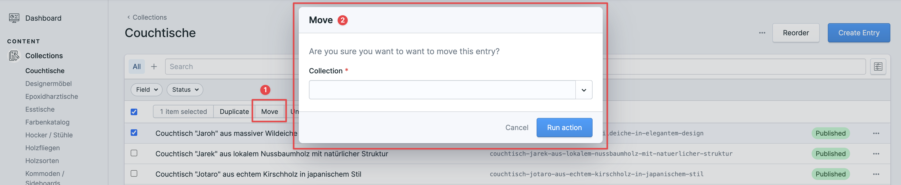
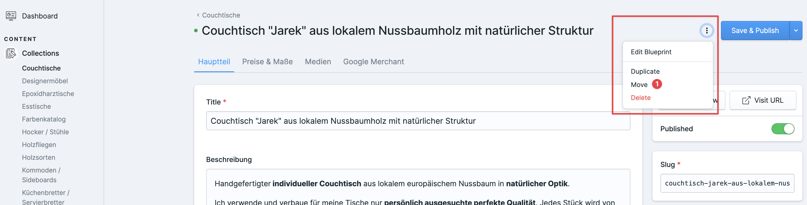

# Statamic Move Entries

Move entries from one collection to another in your Control Panel.

**Features:**

- Move one or multiple entries from one collection to another: available in list view and detail view  
- Confirmation question before moving
- German and English localized
- Config to set collections allowed to filter default is all

:warning: Multi-site support only for Statamic Eloquent entries at the moment. 

**Usage:**

In Statamic Control Panel go into one of your collections and select an entry. A new action valled **Move** is going to show up.
Click this action and a popup will come up to let you select the target selection where you want to move your entry to.

## License

The MIT License (MIT). Please see [License File](LICENSE) for more information.
